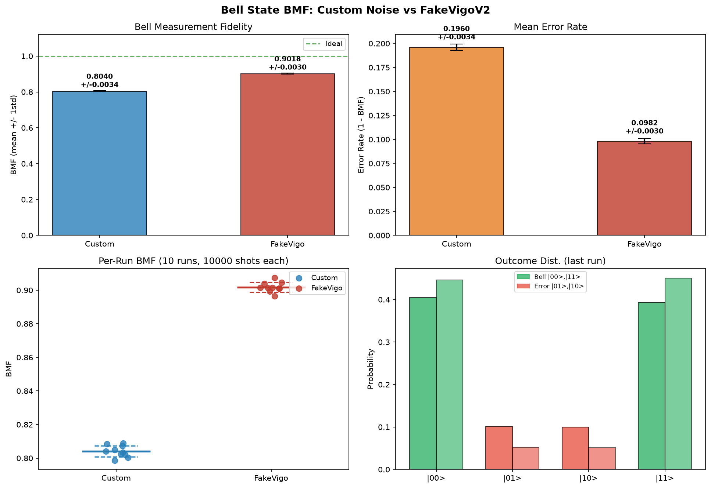

# Bell State Noise Simulation

This repository has the code and figures for my bachelor's project: **Bell State Fidelity under Hardware Noise: Custom Model vs IBM FakeVigoV2**. I compared two noise models to see which one hurts the Bell state more, and I used Bell Measurement Fidelity (BMF) to measure the damage.

**Author:** Umayr Utmaan — Bachelor of Physics, Nangarhar University

## Research Question

Does a hand-built noise model or real IBM device calibration data cause more damage to Bell-state fidelity in simulation?

## What I Did

I built the Bell state |Φ+⟩ = (|00⟩ + |11⟩) / √2 and ran it through two noise models using Qiskit Aer:

- **Custom model** — I built this myself using T1 = 30 µs, T2 = 50 µs, gate errors on H (8.1%) and CX (15.1%), and readout errors. I based the numbers on typical IBM superconducting qubit specs.
- **FakeVigoV2 model** — this one pulls real calibration data from IBM's FakeVigo backend using `NoiseModel.from_backend()`. It uses actual gate error rates and relaxation times from the device.

I ran each model 10 times with 10,000 shots per run. BMF just counts how often you get |00⟩ or |11⟩ — it's not true fidelity (you'd need quantum state tomography for that), but it's a good enough proxy for this project.

## Results

| Model | Mean BMF | Std Dev | Mean Error Rate |
|---|---|---|---|
| Custom (hand-built) | ~0.8027 | ±0.0039 | ~0.1973 |
| FakeVigoV2 (IBM) | ~0.9028 | ±0.0031 | ~0.0972 |
| Difference (Custom − FakeVigo) | −0.10 | — | — |

The FakeVigo model does better because IBM's real calibration numbers are lower than the conservative estimates I used in my custom model.

## Files

```text
.
├── README.md
├── requirements.txt
├── LICENSE
├── scripts/
│   └── bell_state_analysis.py
└── figures/
    └── 
