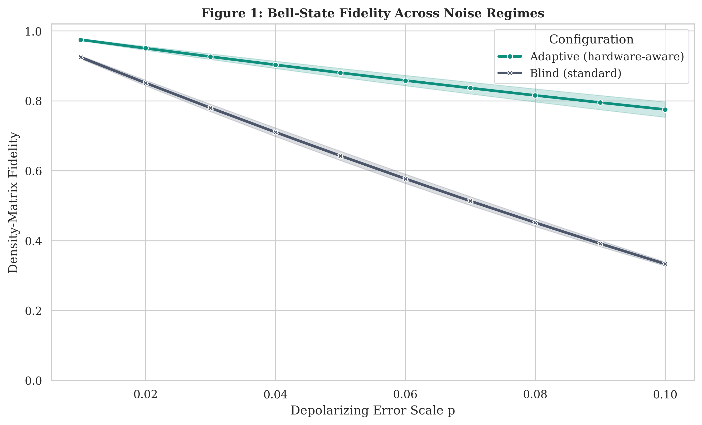
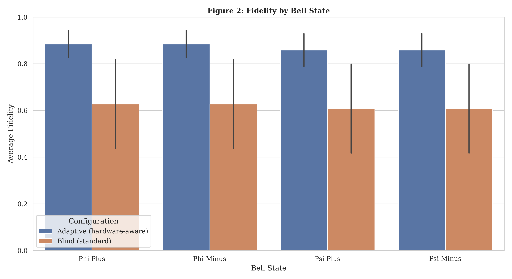
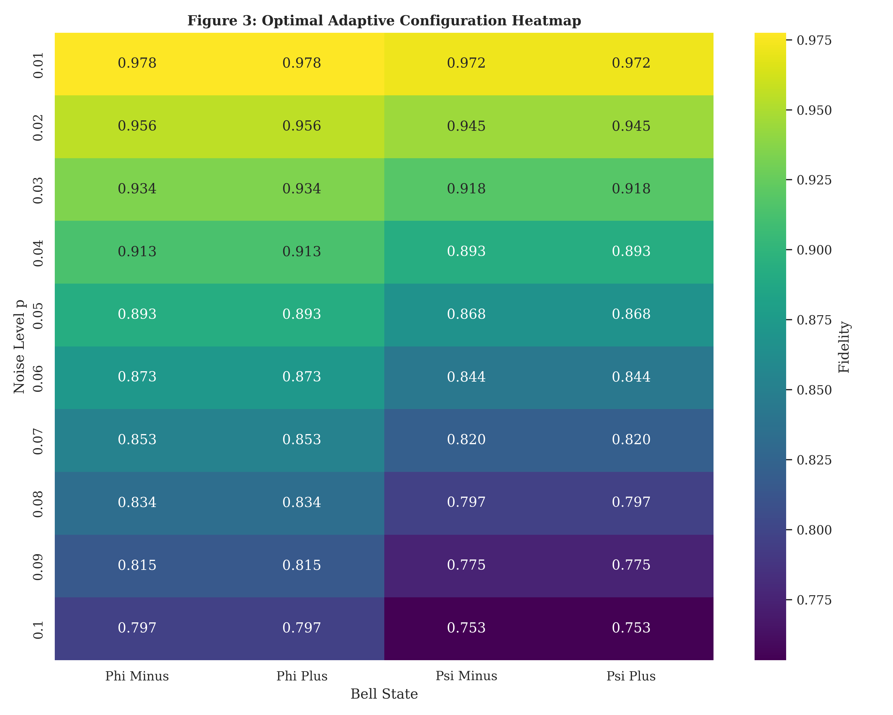
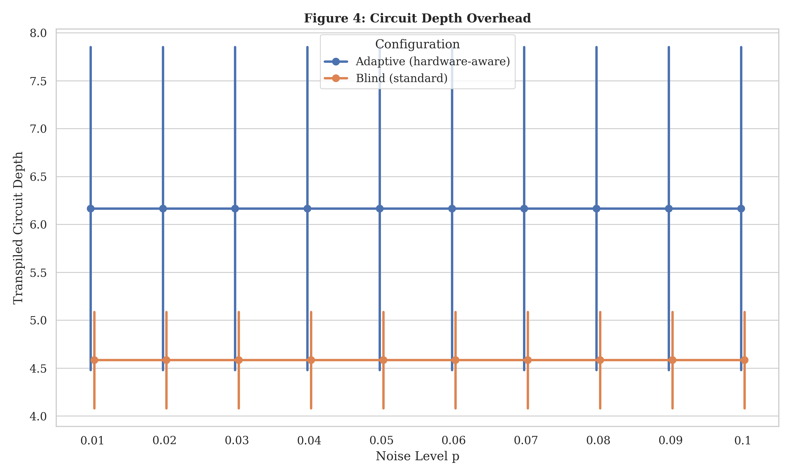
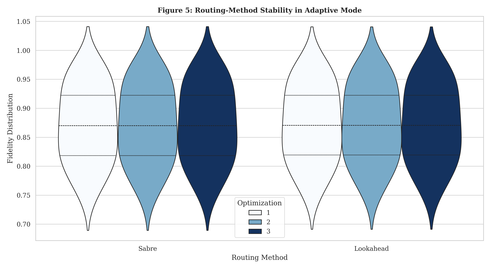
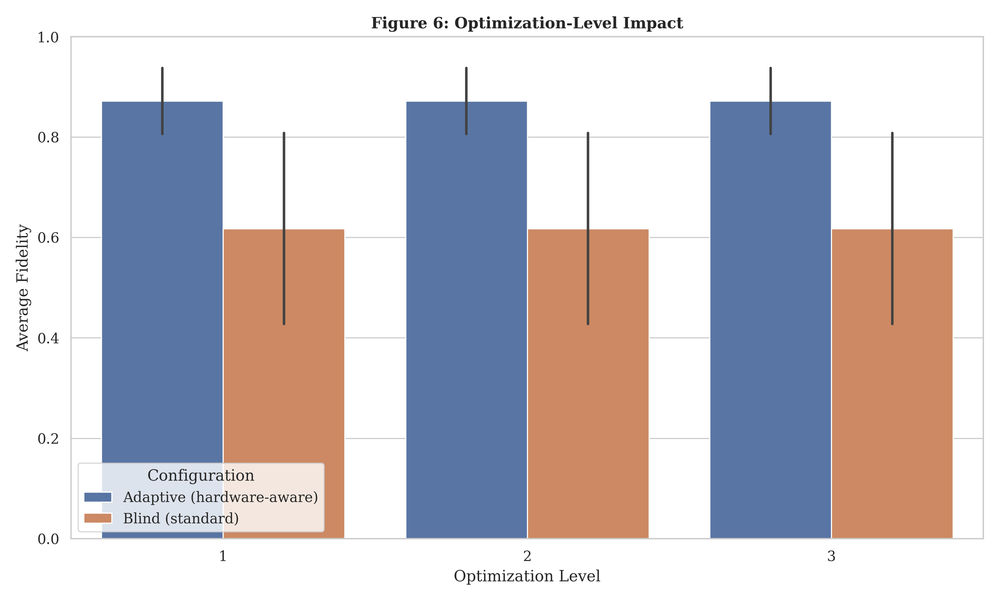

# Hardware-Aware Bell-State Transpilation Benchmark

This repository contains the code, data, figures, and monograph materials for my bachelor's research project on Bell-state transpilation under heterogeneous noise.

The project compares a blind standard initial layout with a hardware-aware adaptive initial layout on the `FakeJakartaV2` backend topology. The benchmark evaluates Bell-state fidelity, measurement success rate, circuit depth, total gate count, and CX gate count across optimization levels, routing methods, and depolarizing noise scales.

## Research Question

How does hardware-aware initial layout selection affect Bell-state transpilation performance under a heterogeneous depolarizing noise model?

## Summary

The benchmark uses Qiskit and Qiskit Aer to simulate four Bell states:

- `phi_plus`
- `phi_minus`
- `psi_plus`
- `psi_minus`

For each Bell state, the experiment compares:

- Blind standard layout selection
- Adaptive hardware-aware layout selection
- Optimization levels 1, 2, and 3
- Sabre and Lookahead routing
- Depolarizing noise scales from `p = 0.01` to `p = 0.10`

The main outputs are a reproducible CSV dataset, benchmark metadata, and publication-ready figures.

## Repository Structure

```text
.
├── README.md
├── requirements.txt
├── src/
│   └── bell_benchmark.py
├── scripts/
│   └── make_bell_figures.py
├── data/
│   └── README.md
├── results/
│   ├── final_journal_data.csv
│   └── benchmark_metadata.json
├── figures/
│   ├── Fig1_Fidelity_vs_Noise.png
│   ├── Fig2_Success_Rate_vs_Noise.png
│   ├── Fig3_Adaptive_Fidelity_Gain.png
│   ├── Fig4_Bell_State_Performance.png
│   ├── Fig5_Adaptive_Heatmap.png
│   ├── Fig6_Transpilation_Cost.png
│   └── Fig7_Routing_Optimization.png
└── docs/
    └── monograph.pdf
```

## How to Reproduce

Install dependencies:

```bash
pip install -r requirements.txt
```

Run the benchmark:

```bash
python src/bell_benchmark.py --out-dir results
```

Generate figures from the CSV:

```bash
python scripts/make_bell_figures.py \
  --csv results/final_journal_data.csv \
  --out-dir figures
```

If you ran the benchmark in Google Colab, copy these files into the repository:

```text
results/final_journal_data.csv
results/benchmark_metadata.json
figures/*.png
figures/*.pdf
```

From Colab, the source files are usually:

```text
/content/bell_benchmark_results/final_journal_data.csv -> results/final_journal_data.csv
/content/bell_benchmark_results/benchmark_metadata.json -> results/benchmark_metadata.json
/content/bell_benchmark_results/paper_figures/*.png
/content/bell_benchmark_results/paper_figures/*.pdf
```

## Figures

### Figure 1: Fidelity vs Noise


### Figure 2: Bell-State Performance


### Figure 3: Adaptive Heatmap


### Figure 4: Circuit Depth


### Figure 5: Routing Comparison


### Figure 6: Optimization Impact


## Limitations

This project is a controlled simulation study, not a claim of universal hardware performance. Important limitations include:

- The backend is a fake IBM topology, not a live quantum processor.
- The noise model is synthetic and deliberately heterogeneous.
- The benchmark focuses on small two-qubit Bell-state circuits.
- Results should be interpreted as evidence for the controlled benchmark setting, not as a general proof that adaptive layout always improves fidelity.

## Suggested Citation

If referencing this repository, cite it as:

```text
Your Name. Hardware-Aware Bell-State Transpilation Benchmark. Bachelor's monograph project, 2026.
```

## License

Choose a license before making the repository public. For code, the MIT License is a common choice. For the written monograph and figures, consider Creative Commons Attribution 4.0 if your university permits it.
